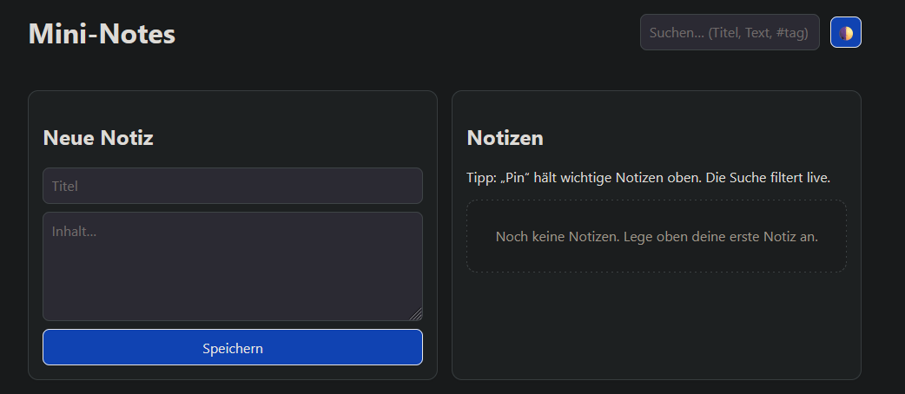
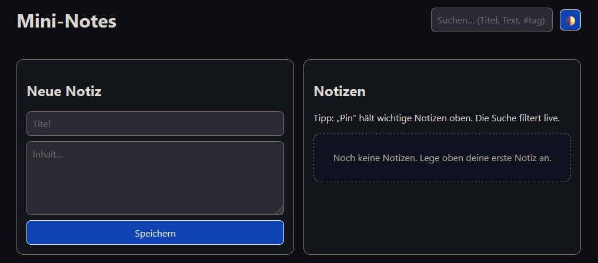

# Mini‑Notes

<!-- Badges: update workflow filename/branch if needed -->
<p align="left">
  <!-- CI status (GitHub Actions) -->
  <a href="https://github.com/rluetken-dev/mini-notes/actions/workflows/ci.yml">
    
  </a>
  <!-- Node version -->
  
  <!-- License -->
  
  <!-- ESLint -->
  
  <!-- Prettier -->
  
</p>

A tiny, fast notes app as a pure frontend demo. No backend, no build chain required — just open it via a local web server.

> **Tech stack:** Vanilla JS (ES Modules), HTML5, CSS (Design Tokens, Light/Dark Mode), localStorage, ESLint (Flat Config), Prettier

---

## Table of Contents

* [Features](#features)
* [Requirements](#requirements)
* [Quick Start](#quick-start)
* [Project Structure](#project-structure)
* [Theming](#theming)
* [Keyboard Shortcuts](#keyboard-shortcuts)
* [Linting & Formatting](#linting--formatting)
* [Data & Privacy](#data--privacy)
* [Roadmap](#roadmap)
* [Deployment](#deployment)
* [Troubleshooting](#troubleshooting)
* [License](#license)

---

## Features

* ✍️ **Create / edit / delete notes**
* 📌 **Pin** important notes to keep them on top
* 🔎 **Live search** (title & content)
* 🌓 **Dark Mode** with **system detection** & **toggle** (persisted in `localStorage`)
* 💾 **Persistence** via `localStorage`
* ⌨️ **Shortcut:** `Ctrl/Cmd + Enter` saves a new note
* ♿ **A11y:** `aria-live` for the list, visually hidden labels, clear focus ring
* 📱 **Responsive:** two-column layout, stacks on mobile

---

## Demo

<p align="center">
  
</p>

<details>
  <summary>Show dark theme</summary>
  <p align="center">
    
  </p>
</details>

<!-- Optional short GIF -->
<!-- Replace demo.gif when you have one -->
<p align="center">
  
</p>

## Requirements

* **Browser:** recent versions of Chrome/Edge, Firefox, or Safari.
* **Node.js (optional – dev tools only):** Node **18+** (recommended **20+**) and npm. Not needed to *use* the app, but helpful for `npm run lint`/`format` and CI.
* **Local web server:** required because of ES Modules (see Quick Start for options).

---

## Quick Start

> You do **not** need a bundler. Simply run a local server in the project root.

```bash
# 1) Clone the repo
# git clone <your-repo-url>
cd mini-notes

# 2) (optional) Install dev dependencies for lint/format
npm install

# 3) Start a local server (pick one)
# – VS Code: "Live Server" extension → open index.html → "Go Live"
# – npx:     npx http-server -c-1 -p 5173
# – python:  python -m http.server 5173

# 4) Open in the browser
# http://localhost:5173
```

> **Why a server?** Because of **ES Modules** (`<script type="module" src="src/app.js">`). Opening `index.html` via `file://` blocks module loading due to CORS and file protocol restrictions.

---

## Project Structure

```
mini-notes/
├─ index.html              # App shell & markup (DE UI, English code comments)
├─ styles.css              # Design tokens, layout, components, dark mode
├─ src/
│  ├─ app.js              # Orchestration: state, render, events
│  ├─ storage.js          # loadNotes()/saveNotes() (localStorage)
│  ├─ theme.js            # Theme controller (toggle, system, persistence)
│  ├─ time.js             # now(), timeAgo() (de-DE)
│  ├─ dialogs.js          # confirmDialog() using the modal
│  └─ utils.js            # generateId(), escapeHtml(), sort, match
├─ eslint.config.mjs       # ESLint Flat Config (ESM, browser)
├─ package.json            # npm scripts (lint/format), dev deps
└─ README.md               # you are here
```

---

## Theming

* **Design tokens** in `:root` (light defaults) + dark variants via `@media (prefers-color-scheme: dark)`.
* **Explicit override** via `html[data-theme="light|dark"]` (set by the toggle button).
* **No hard-coded colors** in components — everything derives from tokens.

**Token highlights:** `--bg`, `--text`, `--muted`, `--card`, `--border`, `--primary`, `--on-primary`, `--danger`, `--on-danger`, `--input-border`, `--accent`, `--accent-bg`, `--accent-ring`, `--empty-*`.

---

## Keyboard Shortcuts

* **Save new note:** `Ctrl/Cmd + Enter`
* **Theme toggle:** click `🌓`

  * Right‑click on `🌓` → reset to **System**

---

## Linting & Formatting

```bash
# Lint (Flat Config)
npm run lint

# Format (Prettier)
npm run format
```

**Notes:**

* ESLint uses the **Flat Config** (`eslint.config.mjs`). Remove legacy `.eslintrc.*` files.
* Prettier handles formatting; ESLint focuses on code quality.

---

## Data & Privacy

* All data is stored **locally in the browser** via `localStorage`.
* **No** data is sent to any server.
* You can clear storage manually in your browser at any time.

---

## Roadmap (ideas)

* `#tags` in search (tokenization & AND/OR)
* Highlight matches in content
* **Export/Import** (JSON) for backup/sharing
* Sorting (e.g., by `updatedAt`, `title`)
* Markdown support (read‑only render)
* PWA (offline, installable)
* Unit tests (e.g., Vitest for utils)

---

## Deployment

* **GitHub Pages:** static hosting — publish the `main` branch or a `docs/` folder.
* **Netlify/Vercel:** set up as a “Static Site”, leave build command empty.

---

## Troubleshooting

**ES Modules won’t load?**

* Make sure you use `http://localhost:…` (not `file://`).
* Confirm that `index.html` includes:

  ```html
  <script type="module" src="src/app.js"></script>
  ```

**ESLint complains about `import/export`?**

* Ensure **`eslint.config.mjs`** exists in the project root with `sourceType: 'module'`.
* Remove old `.eslintrc.*` files if present.

**Dark Mode doesn’t change?**

* Check the `#theme-toggle` button exists in `index.html`.
* Open DevTools → Console: any errors accessing `localStorage`?

---

## License

MIT (feel free to use, learn, and extend)
